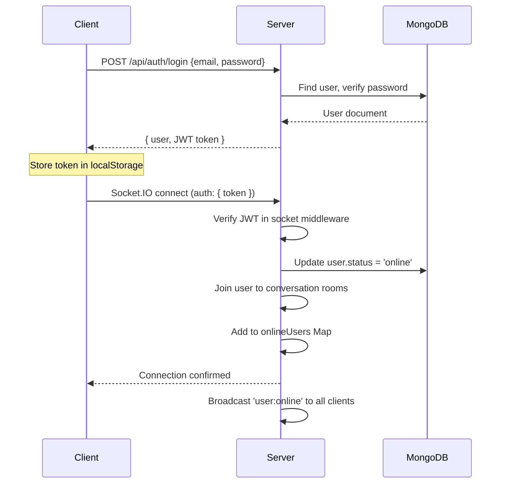
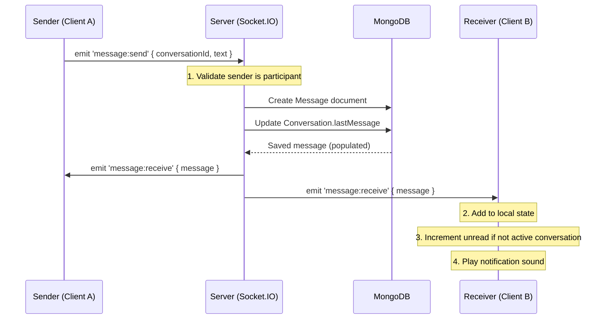
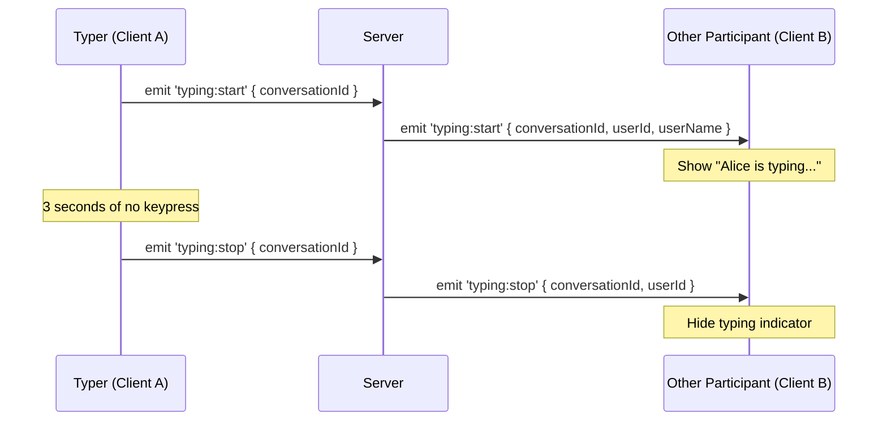
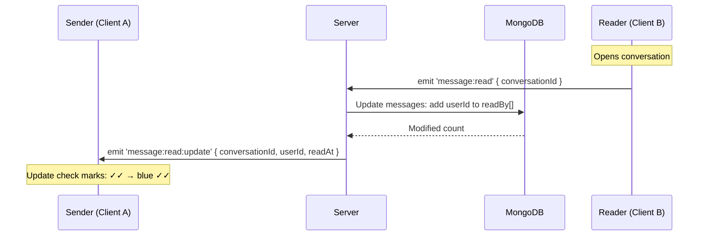
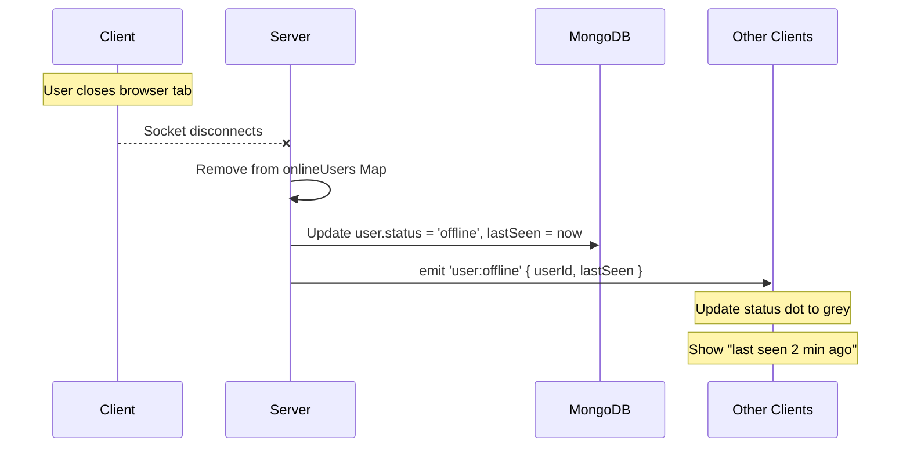
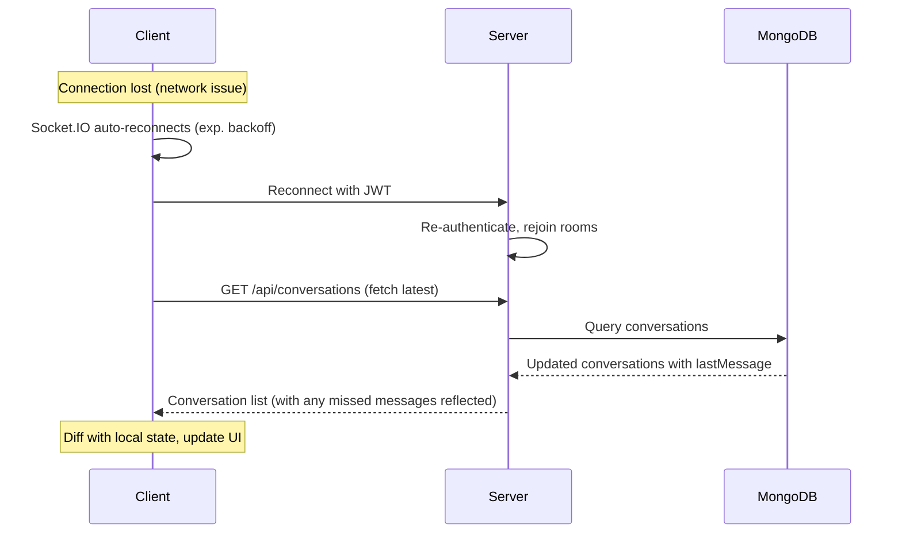

# Architecture — Real-Time Event Flow

This document explains how real-time events flow through the LiveChat application, from client interaction to database persistence to broadcast.

## System Overview

```
┌─────────────────┐     HTTP/REST      ┌──────────────────┐     Mongoose      ┌──────────────┐
│                 │ ──────────────────> │                  │ ───────────────>  │              │
│   React Client  │                    │  Express Server   │                   │   MongoDB    │
│   (Vite Dev)    │ <───────────────── │  + Socket.IO      │ <──────────────── │              │
│                 │     WebSocket      │                  │                   │              │
└─────────────────┘                    └──────────────────┘                   └──────────────┘
     :5173                                   :5000
```

## Connection Lifecycle

### 1. Authentication & Socket Connection



### 2. Sending a Message

This is the core real-time flow. When a user sends a message:



**Key implementation detail**: The message is broadcast to the entire conversation room (`io.to(conversationId).emit(...)`), which means all participants (including the sender) receive it. The client checks `message.senderId === currentUser.id` to distinguish sent vs received.

### 3. Typing Indicators



**Client-side debouncing**: The client uses a 3-second debounce timer. On each keypress, if `typing:start` hasn't been sent recently, it emits the event and starts a timer. If no keypress occurs for 3 seconds, it emits `typing:stop`. This prevents excessive socket traffic.

### 4. Read Receipts



**Message states**:
| State | Icon | Meaning |
|-------|------|---------|
| Sent | ✓ | Server received and persisted the message |
| Delivered | ✓✓ | At least one recipient's client received it |
| Read | ✓✓ (blue) | Recipient opened the conversation |

### 5. Presence (Online/Offline)



**Multi-tab support**: The server tracks `Map<userId, Set<socketId>>`. A user is only marked offline when their *last* socket disconnects (i.e., all tabs are closed).

### 6. Reconnection & Missed Messages



## Socket Event Reference

### Client → Server

| Event | Payload | Description |
|-------|---------|-------------|
| `message:send` | `{ conversationId, text, attachmentUrl?, attachmentType? }` | Send a message |
| `message:read` | `{ conversationId }` | Mark all messages in conversation as read |
| `typing:start` | `{ conversationId }` | User started typing |
| `typing:stop` | `{ conversationId }` | User stopped typing |

### Server → Client

| Event | Payload | Description |
|-------|---------|-------------|
| `message:receive` | `{ _id, conversationId, senderId, text, ... }` | New message |
| `message:read:update` | `{ conversationId, userId, readAt }` | Messages were read |
| `typing:start` | `{ conversationId, userId, userName }` | Someone started typing |
| `typing:stop` | `{ conversationId, userId }` | Someone stopped typing |
| `user:online` | `{ userId }` | A user came online |
| `user:offline` | `{ userId, lastSeen }` | A user went offline |
| `conversation:created` | `{ conversation }` | New conversation created |
| `conversation:updated` | `{ conversation }` | Conversation updated |
| `error` | `{ message }` | Socket error |

## Data Flow Diagram

```
┌──────────────────────────────────────────────────────────────────────┐
│                        CLIENT (React)                                │
│                                                                      │
│  ┌──────────┐    ┌──────────────┐    ┌─────────────┐                │
│  │ AuthCtx  │───>│  SocketCtx   │───>│   ChatCtx   │                │
│  │          │    │              │    │             │                │
│  │ user     │    │ socket       │    │ convos      │                │
│  │ token    │    │ isConnected  │    │ messages    │                │
│  │ login()  │    │ onlineUsers  │    │ unreadCnts  │                │
│  │ logout() │    │              │    │ typingUsers │                │
│  └──────────┘    └──────┬───────┘    └──────┬──────┘                │
│                         │                    │                       │
│                    WebSocket             REST API                    │
│                         │                    │                       │
└─────────────────────────┼────────────────────┼───────────────────────┘
                          │                    │
                          ▼                    ▼
┌──────────────────────────────────────────────────────────────────────┐
│                        SERVER (Express + Socket.IO)                   │
│                                                                      │
│  ┌─────────────┐    ┌───────────────┐    ┌────────────────┐         │
│  │ Socket.IO   │    │ Express API   │    │  Middleware     │         │
│  │             │    │               │    │                │         │
│  │ JWT Auth MW │    │ /api/auth     │    │ JWT Protect    │         │
│  │ Msg Handler │    │ /api/users    │    │ Rate Limiter   │         │
│  │ Presence    │    │ /api/convos   │    │ Validation     │         │
│  │ Typing      │    │ /api/messages │    │ File Upload    │         │
│  └──────┬──────┘    └───────┬───────┘    └────────────────┘         │
│         │                   │                                        │
│         └─────────┬─────────┘                                        │
│                   │ Mongoose                                         │
│                   ▼                                                  │
│         ┌─────────────────┐                                          │
│         │ MongoDB Models  │                                          │
│         │ User            │                                          │
│         │ Conversation    │                                          │
│         │ Message         │                                          │
│         └─────────────────┘                                          │
└──────────────────────────────────────────────────────────────────────┘
```

## Room Strategy

Socket.IO rooms are used to scope message broadcasts:

- **Conversation room** (`conversation._id`): Every participant in a conversation joins this room. Messages and typing events are broadcast to the room.
- **User room** (`user._id`): Each user joins their own personal room. Used for direct notifications like "new conversation created" when another user initiates a chat.

```javascript
// On connection, join all relevant rooms
const conversations = await Conversation.find({ participants: userId });
conversations.forEach(conv => {
  socket.join(conv._id.toString());   // Join each conversation room
});
socket.join(userId.toString());        // Join personal room
```

## Scaling Considerations

The current architecture is designed for single-server deployment. For horizontal scaling:

1. **Socket.IO Adapter**: Use `@socket.io/redis-adapter` to share socket state across servers
2. **Online Users**: Move `onlineUsers` Map to Redis
3. **Session Affinity**: Configure load balancer for sticky sessions (or use Redis adapter)
4. **File Storage**: Use Cloudinary (already supported) instead of local storage
