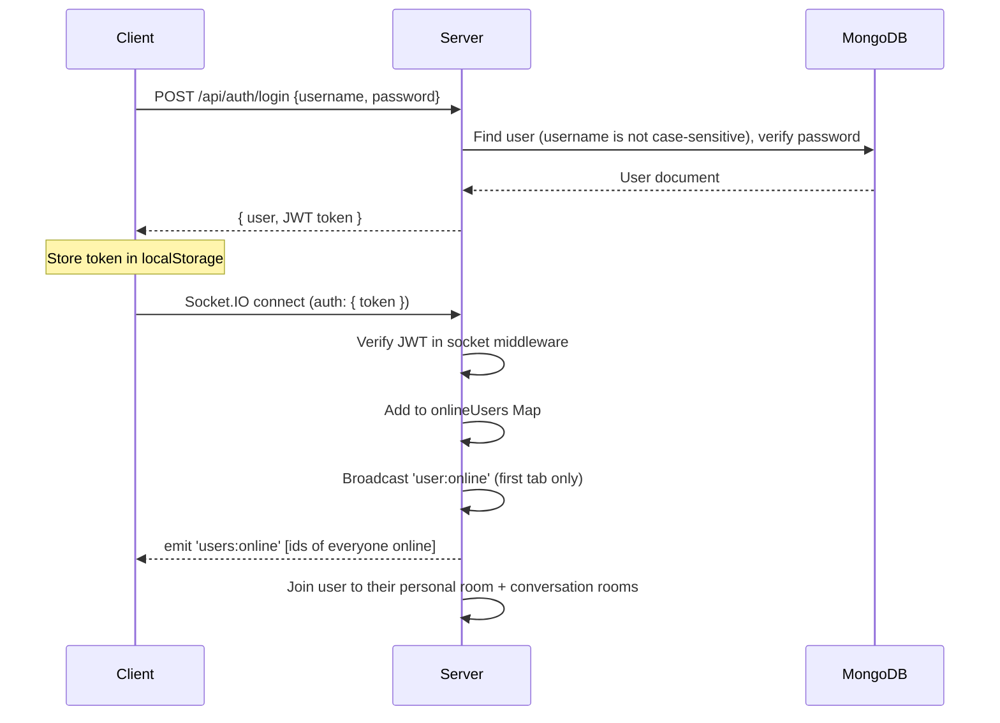
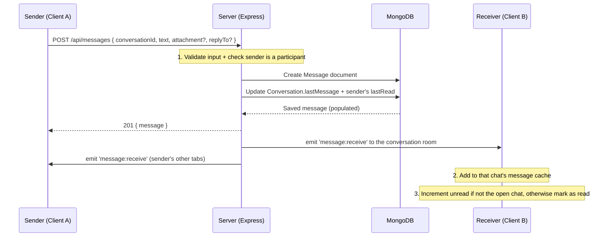
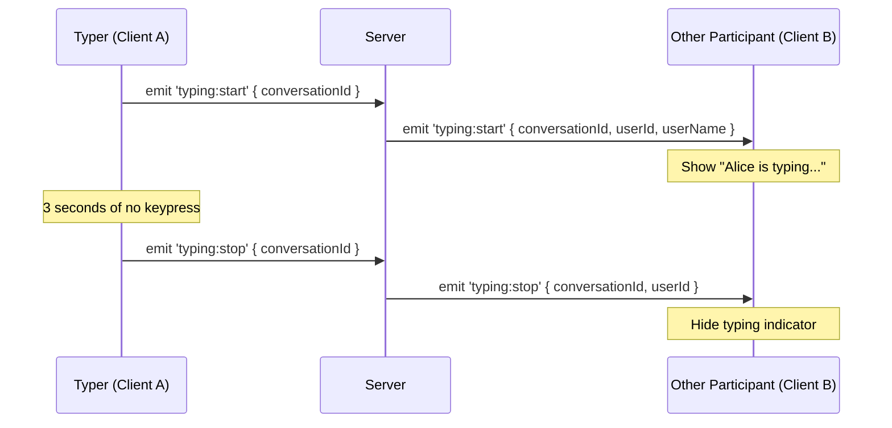
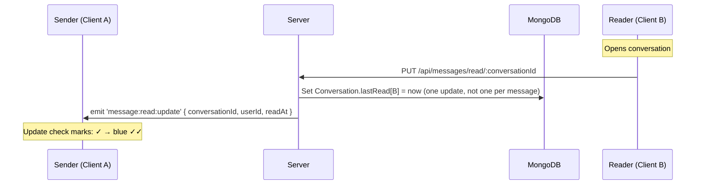
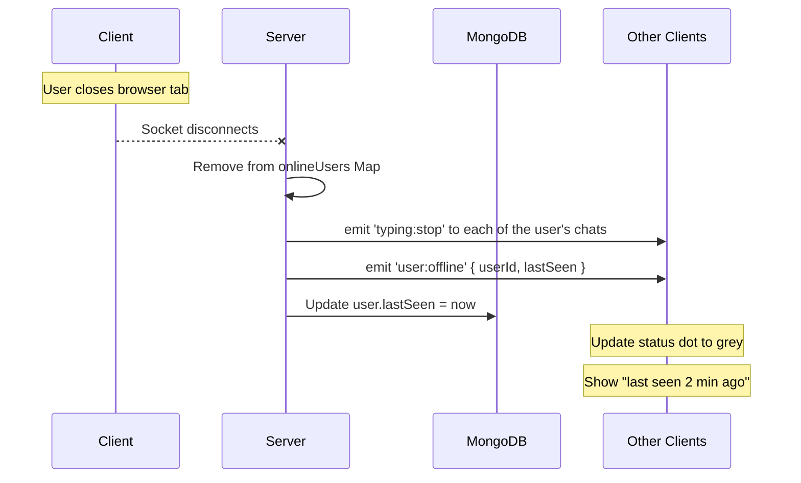
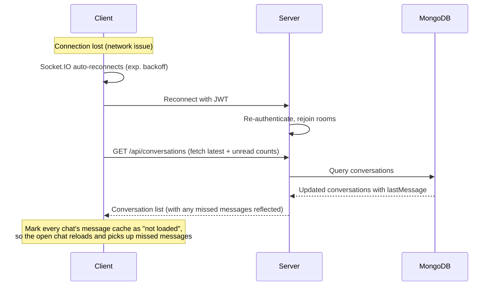

# Architecture — Real-Time Event Flow

This document explains how real-time events flow through the LiveChat application, from client interaction to database persistence to broadcast.

## System Overview

```
┌─────────────────┐     HTTP/REST      ┌──────────────────┐     Mongoose      ┌──────────────┐
│                 │ ──────────────────> │                  │ ───────────────>  │              │
│   React Client  │                    │  Express Server   │                   │   MongoDB    │
│   (Vite Dev)    │ <───────────────── │  + Socket.IO      │ <──────────────── │              │
│                 │     WebSocket      │                  │                   │              │
└─────────────────┘                    └──────────────────┘                   └──────────────┘
     :5173                                   :5000
```

## Connection Lifecycle

### 1. Authentication & Socket Connection


```mermaid
sequenceDiagram
    participant C as Client
    participant S as Server
    participant DB as MongoDB

    C->>S: POST /api/auth/login {username, password}
    S->>DB: Find user (username is not case-sensitive), verify password
    DB-->>S: User document
    S-->>C: { user, JWT token }
    Note over C: Store token in localStorage

    C->>S: Socket.IO connect (auth: { token })
    S->>S: Verify JWT in socket middleware
    S->>S: Add to onlineUsers Map
    S->>S: Broadcast 'user:online' (first tab only)
    S-->>C: emit 'users:online' [ids of everyone online]
    S->>S: Join user to their personal room + conversation rooms
```

"Online" lives only in the server's memory (`onlineUsers` Map). The database only stores `lastSeen`.

### 2. Sending a Message

This is the core real-time flow. Messages are **sent over REST** and **delivered over Socket.IO**, so there is exactly one place that creates messages (`message.controller.js#sendMessage`) and it gets validation, rate limiting and proper error responses:


```mermaid
sequenceDiagram
    participant A as Sender (Client A)
    participant S as Server (Express)
    participant DB as MongoDB
    participant B as Receiver (Client B)

    A->>S: POST /api/messages { conversationId, text, attachment?, replyTo? }
    Note over S: 1. Validate input + check sender is a participant
    S->>DB: Create Message document
    S->>DB: Update Conversation.lastMessage + sender's lastRead
    DB-->>S: Saved message (populated)
    S-->>A: 201 { message }
    S->>B: emit 'message:receive' to the conversation room
    S->>A: emit 'message:receive' (sender's other tabs)
    Note over B: 2. Add to that chat's message cache
    Note over B: 3. Increment unread if not the open chat, otherwise mark as read
```

**Key implementation detail**: The sender gets the message twice (HTTP response + socket event). The client ignores duplicates by `_id`, so it shows immediately even if the socket is slow.

### New conversations

Sockets join their rooms when they connect, so a conversation created later needs extra work. When a conversation is created (or a member is added), the controller makes every member's open tabs join the new room and tells them about it:

```javascript
participantIds.forEach((userId) => {
  joinRoom(userId, conversation._id);                          // io.in(userId).socketsJoin(convId)
  emitToRoom(userId, CONVERSATION_CREATED, populatedConv);     // adds it to their sidebar
});
```

### 3. Typing Indicators


```mermaid
sequenceDiagram
    participant A as Typer (Client A)
    participant S as Server
    participant B as Other Participant (Client B)

    A->>S: emit 'typing:start' { conversationId }
    S->>B: emit 'typing:start' { conversationId, userId, userName }
    Note over B: Show "Alice is typing..."

    Note over A: 3 seconds of no keypress
    A->>S: emit 'typing:stop' { conversationId }
    S->>B: emit 'typing:stop' { conversationId, userId }
    Note over B: Hide typing indicator
```

**Client-side debouncing**: The client uses a 3-second debounce timer. On each keypress, if `typing:start` hasn't been sent recently, it emits the event and starts a timer. If no keypress occurs for 3 seconds, it emits `typing:stop`. This prevents excessive socket traffic.

### 4. Read Receipts


```mermaid
sequenceDiagram
    participant A as Sender (Client A)
    participant S as Server
    participant DB as MongoDB
    participant B as Reader (Client B)

    Note over B: Opens conversation
    B->>S: PUT /api/messages/read/:conversationId
    S->>DB: Set Conversation.lastRead[B] = now (one update, not one per message)
    S->>A: emit 'message:read:update' { conversationId, userId, readAt }
    Note over A: Update check marks: ✓ → blue ✓✓
```

Each conversation stores `lastRead: [{ user, at }]` — when each member last read it.

- **Unread count** (returned by `GET /api/conversations`): messages from other people newer than my `lastRead`.
- **Seen**: a message is seen once *every* other member's `lastRead` is after it (so in a group, ticks turn blue only when everyone has read it).

**Message states**:
| State | Icon | Meaning |
|-------|------|---------|
| Sent | ✓ | Server received and persisted the message |
| Seen | ✓✓ (blue) | Every other member has opened the conversation since |

### 5. Presence (Online/Offline)


```mermaid
sequenceDiagram
    participant C as Client
    participant S as Server
    participant DB as MongoDB
    participant Others as Other Clients

    Note over C: User closes browser tab
    C--xS: Socket disconnects
    S->>S: Remove from onlineUsers Map
    S->>Others: emit 'typing:stop' to each of the user's chats
    S->>Others: emit 'user:offline' { userId, lastSeen }
    S->>DB: Update user.lastSeen = now
    Note over Others: Update status dot to grey
    Note over Others: Show "last seen 2 min ago"
```

**Multi-tab support**: The server tracks `Map<userId, Set<socketId>>`. A user is only marked offline when their *last* socket disconnects (i.e., all tabs are closed).

### 6. Reconnection & Missed Messages


```mermaid
sequenceDiagram
    participant C as Client
    participant S as Server
    participant DB as MongoDB

    Note over C: Connection lost (network issue)
    C->>C: Socket.IO auto-reconnects (exp. backoff)
    C->>S: Reconnect with JWT
    S->>S: Re-authenticate, rejoin rooms
    C->>S: GET /api/conversations (fetch latest + unread counts)
    S->>DB: Query conversations
    DB-->>S: Updated conversations with lastMessage
    S-->>C: Conversation list (with any missed messages reflected)
    Note over C: Mark every chat's message cache as "not loaded",<br/>so the open chat reloads and picks up missed messages
```

## Socket Event Reference

Sending messages and marking chats as read use the REST API (`POST /api/messages`, `PUT /api/messages/read/:id`). Sockets are used for receiving updates and for the typing indicator.

### Client → Server

| Event | Payload | Description |
|-------|---------|-------------|
| `typing:start` | `{ conversationId }` | User started typing (ignored if the user isn't a member) |
| `typing:stop` | `{ conversationId }` | User stopped typing |

### Server → Client

| Event | Payload | Description |
|-------|---------|-------------|
| `message:receive` | `{ _id, conversationId, senderId, text, ... }` | New message |
| `message:read:update` | `{ conversationId, userId, readAt }` | A member read the chat |
| `typing:start` | `{ conversationId, userId, userName }` | Someone started typing |
| `typing:stop` | `{ conversationId, userId }` | Someone stopped typing |
| `users:online` | `[userId, ...]` | Everyone online, sent once on connect |
| `user:online` | `{ userId }` | A user came online |
| `user:offline` | `{ userId, lastSeen }` | A user went offline |
| `conversation:created` | `{ conversation }` | You were added to a new chat |
| `conversation:updated` | `{ conversation }` | Chat changed (e.g. members added/removed) |
| `conversation:removed` | `{ conversationId }` | You were removed from (or left) a group |

## Data Flow Diagram

```
┌──────────────────────────────────────────────────────────────────────┐
│                        CLIENT (React)                                │
│                                                                      │
│  ┌──────────┐    ┌──────────────┐    ┌─────────────┐                │
│  │ AuthCtx  │───>│  SocketCtx   │───>│   ChatCtx   │                │
│  │          │    │              │    │             │                │
│  │ user     │    │ socket       │    │ convos      │                │
│  │ token    │    │ isConnected  │    │ activeId    │                │
│  │ login()  │    │ onlineUsers  │    │ msgCache    │                │
│  │ logout() │    │ lastSeen     │    │ typingUsers │                │
│  └──────────┘    └──────┬───────┘    └──────┬──────┘                │
│                         │                    │                       │
│                    WebSocket             REST API                    │
│                         │                    │                       │
└─────────────────────────┼────────────────────┼───────────────────────┘
                          │                    │
                          ▼                    ▼
┌──────────────────────────────────────────────────────────────────────┐
│                        SERVER (Express + Socket.IO)                   │
│                                                                      │
│  ┌─────────────┐    ┌───────────────┐    ┌────────────────┐         │
│  │ Socket.IO   │    │ Express API   │    │  Middleware     │         │
│  │             │    │               │    │                │         │
│  │ JWT Auth MW │    │ /api/auth     │    │ JWT Protect    │         │
│  │ Room join   │    │ /api/users    │    │ Rate Limiter   │         │
│  │ Presence    │    │ /api/convos   │    │ Validation     │         │
│  │ Typing      │    │ /api/messages │    │ File Upload    │         │
│  └──────┬──────┘    └───────┬───────┘    └────────────────┘         │
│         │                   │                                        │
│         └─────────┬─────────┘                                        │
│                   │ Mongoose                                         │
│                   ▼                                                  │
│         ┌─────────────────┐                                          │
│         │ MongoDB Models  │                                          │
│         │ User            │                                          │
│         │ Conversation    │                                          │
│         │ Message         │                                          │
│         └─────────────────┘                                          │
└──────────────────────────────────────────────────────────────────────┘
```

## Room Strategy

Socket.IO rooms are used to scope message broadcasts:

- **Conversation room** (`conversation._id`): Every participant in a conversation joins this room. Messages and typing events are broadcast to the room. Only members are in the room, so the typing handler uses room membership as its permission check.
- **User room** (`user._id`): Each user joins their own personal room. Used for direct notifications like "new conversation created" when another user initiates a chat.

```javascript
// On connection, join all relevant rooms
socket.join(userId);                   // Join personal room
const conversations = await Conversation.find({ participants: userId });
conversations.forEach(conv => {
  socket.join(conv._id.toString());    // Join each conversation room
});

// Later, from the REST controllers (see socket/index.js):
joinRoom(userId, conversationId);      // new chat / added to a group
leaveRoom(userId, conversationId);     // removed from a group
```

## Scaling Considerations

The current architecture is designed for single-server deployment. For horizontal scaling:

1. **Socket.IO Adapter**: Use `@socket.io/redis-adapter` to share socket state across servers
2. **Online Users**: Move `onlineUsers` Map to Redis
3. **Session Affinity**: Configure load balancer for sticky sessions (or use Redis adapter)
4. **File Storage**: Use Cloudinary (already supported) instead of local storage
